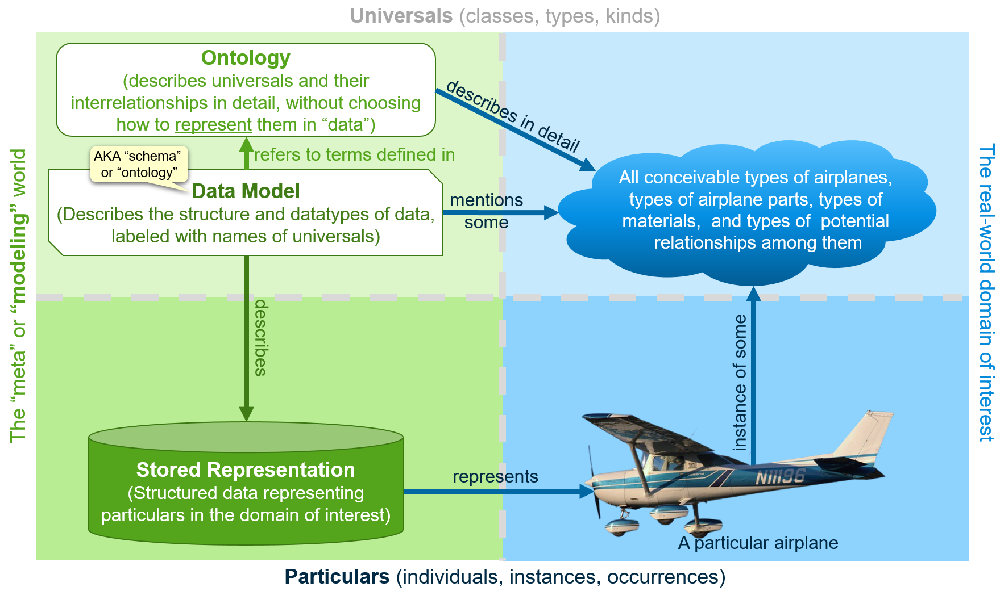
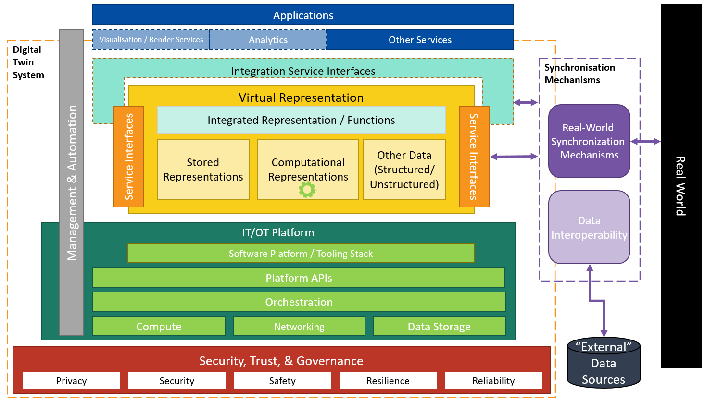

<!-- omit in TOC -->
# Glossary of Digital Twins

> A glossary of digital twins and digital twin technology from the [Digital Twin Consortium](https://www.digitaltwinconsortium.org/).

This glossary is not intended to cover industry-specific domains for which one might build a [digital twin system](#digital-twin-system).

The glossary is a Work-In-Progress draft.

We suggest starting with the term [Digital Twin](#digital-twin) and following links from there.

<!-- omit in TOC -->
## Table of Contents

- [Built Environment Digital Twin](#built-environment-digital-twin)
- [Computational Model](#computational-model)
- [Cyber-Physical System](#cyber-physical-system)
- [Data Model](#data-model)
- [Digital Model](#digital-model)
- [Digital Model Element](#digital-model-element)
- [Digital System-of-Systems](#digital-system-of-systems)
- [Digital Thread](#digital-thread)
- [Digital Twin](#digital-twin)
- [Digital Twin System](#digital-twin-system)
- [Digital Twin System Feature](#digital-twin-system-feature)
- [Digital Twin Use Case](#digital-twin-use-case)
- [Human Digital Twin](#human-digital-twin)
- [Infrastructure Digital Twin](#infrastructure-digital-twin)
- [Interventional Frequency](#interventional-frequency)
- [Model](#model)
- [Modeling Fidelity](#modeling-fidelity)
- [Observational Frequency](#observational-frequency)
- [Persistent Model](#persistent-model)
- [Physical Twin](#physical-twin)
- [Real-to-virtual synchronization](#real-to-virtual-synchronization)
- [Service Interface](#service-interface)
- [Simulation Model](#simulation-model)
- [Subsystems of a Digital Twin System](#subsystems-of-a-digital-twin-system)
- [Synchronization](#synchronization)
- [Synchronization Fidelity](#synchronization-fidelity)
- [Synchronization Frequency](#synchronization-frequency)
- [Synchronization Mechanism](#synchronization-mechanism)
- [Use Case](#use-case)
- [Virtual](#virtual)
- [Virtual Representation](#virtual-representation)
- [Virtual-to-real synchronization](#virtual-to-real-synchronization)
- [Virtual Twin](#virtual-twin)

---

## Built Environment Digital Twin

See [Infrastructure Digital Twin](#infrastructure-digital-twin).

*Back to [Table of Contents](#table-of-contents).*

---

## Computational Model

Use [simulation model](#simulation-model) instead. Though simulation models are indeed computational in nature, we prefer the term that focuses on the intent of the model (to simulate processes in reality) rather than its implementation mechanism.

*Back to [Table of Contents](#table-of-contents).*

---

## Cyber-Physical System

> A system consisting of an integration of physical and digital systems via networking.

A [digital twin](#digital-twin) considered together with its [physical twin](#physical-twin) is an example of a cyber-physical system.

See [Wikipedia's definition of cyber-physical system](https://en.wikipedia.org/wiki/Cyber-physical_system).

*Back to [Table of Contents](#table-of-contents).*

---

## Data Model

> A data model is a [persistent model](#persistent-model) of data that describes its structure, datatypes, and meaning.

A data model will use some __data modeling paradigm__ that defines its approach to __structuring data__. Some examples include:

- The relational paradigm structures data into tables with columns and foreign-keys
- The entity-relationship paradigm structures data into classes with properties and supports relationship classes to express relations.
- The triple-graph paradigm structures data as a series of subject-predicate-object "triples"
- The property-graph paradigm structures data as nodes in a graph with nodes defined by classes with properties and edges defined by separate classes.

The __datatypes__ associated with columns/properties/attributes may be "text" or "date" or "number" or more specialized datatypes such as "integer number" or "floating-point number". The specific datatypes available will vary per data-modeling language.

The __meaning__ of particular data structured according to the data model may be encoded by giving data modeling elements (tables/columns/classes/properties) the names of real-world concepts. For example, particular data that lies in the part of the structure named "equipment.weight" with datatype "number" can be understood to represent the weight of a piece of physical equipment, expressed numerically. Those names may be cross-referenced with natural-language documentation providing a more-detailed description of the meaning of the modeled data. Some data-modeling languages allow additional metadata to be associated to elements, e.g. the units-of-measure for "equipment.weight".

A given data model may lie somewhere along an __implementation spectrum__. It may be an implementation-neutral "logical" or "conceptual" data model or a database-implementation-specific data model like a SQL database schema. Often, a high-level conceptual data model is exposed through an API, but is mapped to a low-level implementation-specific data model by the software that implements the API.

The __subject matter__ of a data model is a [persistent model](#persistent-model). In other words, every [persistent model](#persistent-model) (which consists of particular data) will have a __data model__ that describes the structure and meaning of its digital data.

The __medium__ of a "data model" is a data modeling language, which could be graphical (e.g. a whiteboard diagram or an electronic UML diagram) or lexical (e.g. text that is both human-readable and machine readable in a language like SQL Data Definition Language (DDL), Digital Twin Definition Language ([DTDL](https://github.com/Azure/opendigitaltwins-dtdl/blob/master/DTDL/v2/dtdlv2.md#digital-twins-definition-language)), Web Ontology Language ([OWL](https://en.wikipedia.org/wiki/Web_Ontology_Language)), or many other formats).

The __modeling perspective__ of a "data model" encompasses its data-modeling paradigm, where it sits on the "implementation perspective", as well as the choices it makes to simplify the real-world subject matter into named/structured data that describes aspects of that subject matter.

This figure shows how a [Data Model](#data-model) relates to a [Digital Model](#digital-model) and how both relate to the physical world.

Communication can get tricky when folks use the unqualified term "model" to mean "data model". This is particularly true of people who do "data modeling" as part of their job. They may use a term like "building model" to refer to a __data model__ for creating digital models of buildings (rather than a specific digital model of a particular building). For this reason, it may be helpful to use a synonym like "schema", since "building schema" will be more-reliably interpreted as a "data model for structuring data that represents buildings" and never as a persistent model of a particular building.

As an example, a digital model of a particular real-world building will consist of data that represents relevant aspects of that building for the desired use cases. The digital model will have a "buildings data model" that defines what aspects of the real-world buildings can be expressed in the data of the digital model, and how they are named, structured, and represented in the digital model's data.

***Alternate terms***

- "Ontology" is sometimes used as a synonym for "data model". [DTDL](https://github.com/Azure/opendigitaltwins-dtdl/blob/master/DTDL/v2/dtdlv2.md#digital-twins-definition-language) (using a property-graph data-modeling paradigm) and [OWL](https://en.wikipedia.org/wiki/Web_Ontology_Language) (using a triple-graph data modeling paradigm) are common examples of this usage. This is in contrast to a "philosophical ontology" that might be written in English or Greek, e.g. by [Aristotle](https://en.wikipedia.org/wiki/Ontology#Aristotle).
- "Schema" is sometimes used as a synonym for "data model". DDL defines database schemas. [OData](https://en.wikipedia.org/wiki/Open_Data_Protocol) uses CSDL (Common Schema Definition Language). [RDFS](https://en.wikipedia.org/wiki/RDF_Schema) (Resource Description Framework Schema) is sometimes used in conjunction with OWL to define data models using the triple-graph data-modeling paradigm.
- "Information Model" is sometimes used as a synonym for "data model", though some parties make subtle distinctions between "information model" and "data model", such as taking it to imply a data model that lies on the "conceptual" end of the implementation spectrum.

The fact that some data models are called "ontologies" but are not the same thing as "philosophical ontologies" is a source of confusion.

Even more confusing, it is possible to translate a "philosophical ontology" into a data-modeling language like OWL, resulting in a data-modeling-ontology derived from a philosophical ontology.

Discussion of data models (aka "ontologies" and "schemas") and philosophical ontologies commonly arises in the design and development of [digital models](#digital-model) for [digital twin systems](#digital-twin-system).

*Back to [Table of Contents](#table-of-contents).*

---

## Digital Model

> A representation (of some subject matter) consisting of structured digital information and/or computational algorithms.

Before computers, we only modeled physical things using clay, wood, or plastic models. Nowadays, we use digital models.

By "digital model" we do **not** mean "[data model](#data-model) although most digital models will have a "data model" or "schema" or "ontology" that describes the structure and meaning of the "instance data" in the digital model.

***Narrower terms***

- We divide digital models into two broad categories: [persistent models](#persistent-model) and [simulation models](#simulation-model).

***Related terms***

- In the context of our definition of [digital twin](#digital-twin), a digital model's subject matter may include many entities and processes.
- A digital model consists of one or more [digital model elements](#digital-model-element) that represent individual entities and processes in the subject matter.
  
*Back to [Table of Contents](#table-of-contents).*

---

## Digital Model Element

> A digital model element is an identifiable part of a digital model that represents an individual real-world entity or process.

***Alternate, non-preferred terms***

- Every kind of [digital model](#digital) will have its own terminology to refer to its identifiable parts. Those terms are completely appropriate (and preferred) in the context of those specific kinds of digital models, but to the extent that we need discuss digital models in general, we need a single term for their parts. Common alternate terms include "record", "row", "object", "entity", "node", "triple", and even "digital twin" (defined somewhat differently than here.)

*Back to [Table of Contents](#table-of-contents).*

---

## Digital System-of-Systems

> A digital system-of-systems is a digital system comprised of one or more other digital systems

*Back to [Table of Contents](#table-of-contents).*

---

## Digital Thread

> Digital thread is a mechanism for correlating information across multiple dimensions of the virtual representation, where the dimensions include (but are not limited to) time or lifecycle stage (including design intent), kind-of-model, and configuration history.

Digital thread generally relies on stable, consistent real-world identifiers to "join" across different repositories of information.

*Back to [Table of Contents](#table-of-contents).*

---

## Digital Twin

> A digital twin is a [virtual representation](#virtual-representation) of real-world entities and processes, [synchronized](#synchronization) at a specified [frequency](#synchronization-frequency) and [fidelity](#synchronization-fidelity).

[Digital Twin Systems](#digital-twin-system) transform business by accelerating holistic understanding, optimal decision-making, and effective action.

Digital Twins use real-time and historical data to represent the past and present and simulate predicted futures.

Digital Twins are motivated by outcomes, tailored to use cases, powered by integration, built on data, guided by domain knowledge, and implemented in IT/OT systems.

**The subject matter of a digital twin**
In the definition, the "subject matter" of the Digital Twin is "real-world entities and processes," where:

- "Entities" refers to things that __exist__ over a significant time-span. In the context of Digital Twins, these are mostly physical objects but also include immaterial things like organizations, supply-chains, and work-orders, etc.
- "Processes" refers to events or activities that __occur__ in time. These might be transportation journeys or accidents, power outages, pharmaceutical production processes, weather events, heart attacks, or destructive processes such as corrosion.
- "Systems" consist of entities interacting in processes for a given purpose. Though they are not explicitly mentioned in the definition, they are included in the "subject matter" of a Digital Twin.

***Alternate, non-preferred terms***

- [Virtual Twin](#virtual-twin)

***Narrower terms***

- [Human Digital Twin](#human-digital-twin)
- [Infrastructure Digital Twin](#infrastructure-digital-twin)

***Related terms***

- A digital twin is implemented in a [digital twin system](#digital-twin-system).
- The [digital models](#digital-model) that constitute a digital twin are synchronized at a specified [frequency](#synchronization-frequency).
- The [digital models](#digital-model) that constitute a digital twin are synchronized at a specified [fidelity](#synchronization-fidelity).
- A digital twin has a corresponding [physical twin](#physical-twin).
- A digital twin is part of a [cyber-physical system](#cyber-physical-system).

[//]: # (This entry was written by DTC 3T Committee)
[//]: # (Some other comment or metadata)

*Back to [Table of Contents](#table-of-contents).*

---

## Digital Twin System

> A digital twin system is a [system-of-systems](#digital-system-of-systems) that implements a [digital twin](#digital-twin).

Examples of subsystems of digital twin systems include the virtual representation, synchronization (observation and intervention) mechanism(s), data integration, analysis, visualization, user interfaces, security, etc.

***Narrower terms***

- See narrower terms for [digital twin](#digital-twin). Each kind of digital twin has a corresponding kind of digital twin system.

***Related terms***

- A digital twin system implements a [digital twin](#digital-twin).
- A digital twin system comprises [subsystems](#subsystems-of-a-digital-twin-system) that implement [digital twin system features](#digital-twin-system-feature).

*Back to [Table of Contents](#table-of-contents).*

---

## Digital Twin System Feature

> A digital twin system feature is a functionality of a [digital twin system](#digital-twin-system).

Digital twin system features are generally implemented by [subsystems of the digital twin system](#subsystems-of-a-digital-twin-system)

*Back to [Table of Contents](#table-of-contents).*

---

## Digital Twin Use Case

> A digital twin use case is a [use case](#use-case) in which digital twins may be used to accomplish desired outcomes.

Digital Twin use cases are designed to improve outcomes, provide requirements for digital twin systems.

A digital twin use case typically defines requirements for [synchronization](#synchronization) including [synchronization frequency](#synchronization-frequency), etc.

*Back to [Table of Contents](#table-of-contents).*

---

## Human Digital Twin

> A human digital twin is a [digital twin](#digital-twin) that represents a human, its internal systems, and its interactions with its environment.

*Back to [Table of Contents](#table-of-contents).*

---

## Infrastructure Digital Twin

> An infrastructure digital twin is a [digital twin](#digital-twin) that represents infrastructure assets and systems, their environment, and productive and non-productive processes relevant to their operation.

Examples of assets include roads, rail, facilities, buildings, bridges, offshore platforms, etc.

Examples of systems include transportation and utility networks, heating systems, etc.

Examples of the environment include geographic features and portions of the built environment that are not modeled as assets.

Examples of processes include the flows of traffic, resources, or people; weather, floods, fires, earthquakes, and other resilience-related events; corrosion and other forms of degradation; solar, wind, hydroelectric, or other sources of energy generation; etc.

***Alternate terms***

- [Built Environment Digital Twin](#built-environment-digital-twin) is a viable alternative term that is semantically more inclusive of "Buildings" which are sometimes considered to be distinct from "Infrastructure".

*Back to [Table of Contents](#table-of-contents).*

---

## Interventional Frequency

> An interventional frequency is a [synchronization frequency](#synchronization-frequency) characterizing how often interventions in reality occur in order to synchronize reality with the state of a [digital model](#digital-model).

*Back to [Table of Contents](#table-of-contents).*

---

## Model

> A representation __of__ some subject matter modeled __in__ some medium __from__ some modeling perspective.

The __subject matter__ could be a car, a city, a supply chain, or a factory and its surroundings.

The __modeling medium__ could be clay, wood, plastic, mathematical equations in a spreadsheet, or ink-on-paper. [Digital twins](#digital-twin) are mostly concerned with the "digital" medium--information stored as bits and bytes that can be loaded into a computer's working memory. In the context of digital twins, the unqualified use of "model" should be taken to mean [digital model](#digital-model).

The __modeling perspective__ is the set simplifications made by the modeler. Every model simplifies its subject matter in some way, otherwise it would be an actual replica of the subject matter. It may be smaller in scale or lower in fidelity. It may only represent geometric aspects or also represent material composition. It may only represent functional or financial or legal aspects. It may represent a complex 3D form as a simple curve in space or as a set of triangles. It is common for representational models to represent "any and all aspects of the subject matter that are relevant to the use cases for the model" without explicitly stating their modeling perspective.

When you see "____ model" sometimes the blank is filled with the subject matter (e.g. a "building model") and sometimes with a modeling media (e.g. a "clay model" or "digital model") and occasionally even with a modeling perspective (e.g. a "functional model", "physical model", or "financial model").

Whether a digital model is a [persistent model](#persistent-model) or [simulation model](#simulation-model) can also be considered part of its modeling perspective.

*Back to [Table of Contents](#table-of-contents).*

---

## Modeling Fidelity

*Back to [Table of Contents](#table-of-contents).*

---

## Observational Frequency

> An observational frequency is a [synchronization frequency](#synchronization-frequency) characterizing how often observations of reality are made and reflected in a [digital model](#digital-model).

*Back to [Table of Contents](#table-of-contents).*

---

## Persistent Model

> A persistent (digital) model is a [digital model](#digital-model) consisting of stored structured information, representing states of some subject matter.

A persistent model can be queried, in contrast to a [simulation model](#simulation-model), which must be executed to produce output.

Examples of persistent models include databases of all kinds including relational databases, graph databases and other NoSQL databases, specialized CAD, BIM, and GIS repositories, 3D meshes derived from photogrammetry and/or point clouds, satellite or radar imagery, spreadsheets, intelligent 2D drawings and schematics, IoT "data historians", etc.

***Related terms***

- [Persistent models](#persistent-model) are distinguished from [simulation models](#simulation-model), that contain algorithms.

*Back to [Table of Contents](#table-of-contents).*

---

## Physical Twin

> A physical twin is a set of real-world entities and processes that corresponds to a [digital twin](#digital-twin)

The physical twin is the subject matter [modeled](#model) by a digital twin.

The physical twin may constitute physical systems of interest and their environment, interactions, and processes.

***Alternate, non-preferred terms***

- Physical asset - May be used in specific domains (such as infrastructure), but is not broad enough for general purposes.

[//]: # (Written by Casey Mullen)
[//]: # (See )

*Back to [Table of Contents](#table-of-contents).*

---

## Real-to-virtual synchronization

> Real-to-virtual synchronization (aka observational synchronization) is [synchronization](#synchronization) that causes a digital model to reflect new observations of the real world.

In other words, it is the process of mirroring the real world in the virtual representation, based on observation of the real-world.

*Back to [Table of Contents](#table-of-contents).*

---

## Service Interface

> A system’s service interface is a digitally addressable endpoint that implements a protocol through which other systems and services may interact with the system.

***Narrower terms***

- Each [subsystem](#subsystems-of-a-digital-twin-system) may have its own service interface, e.g. a virtual representation service interface, or a service interface for a particular kind of digital model, or a visualization service interface, etc.

*Back to [Table of Contents](#table-of-contents).*

---

## Simulation Model

> A simulation model is an *executable* [digital model](#digital-model) consisting of computational algorithms and supporting data representing some subject matter from a dynamic perspective.

The subject matter of simulation model is typically a process or a set of entities with properties that are changing over the time-frame of interest.

When executed (aka “run”), simulation models often take [persistent models](#persistent-model) as input and their computational algorithms produce [persistent models](#persistent-model) as output.

Simulation models may also use reference data, which is really just another example of a [persistent model](#persistent-model).

Examples of simulation models include Finite Element Analysis (FEA) models, Machine Learning models, and various other kinds of simulations based on mathematical equations, including those describing laws of physics and engineering.

***Related terms***

[Simulation models](#simulation-model) are distinguished from [persistent models](#persistent-model), that do not contain algorithms.

***Alternate terms***

- [Computational model](#computational-model)
  
*Back to [Table of Contents](#table-of-contents).*

---

## Subsystems of a Digital Twin System

> A subsystem of a digital twin system is a system that implements a [digital twin system feature](#digital-twin-system-feature).

Examples of subsystems of digital twin systems include the virtual representation, synchronization synchronization (observation and intervention) mechanism(s), data integration, analysis, visualization, user interfaces, security, etc.

Subsystems of a digital twin system may have [service interfaces](#service-interface)

*Back to [Table of Contents](#table-of-contents).*

---

## Synchronization

> Synchronization is the process of causing the [virtual representation](#virtual-representation) to more-closely match the real-world or cause the real-world to more-closely match the [virtual representation](#virtual-representation) of a desired state.

Synchronization is implemented via some [synchronization mechanism](#synchronization-mechanism).

***Narrower terms***

- [Real-to-virtual synchronization](#real-to-virtual-synchronization)
- [Virtual-to-real synchronization](#virtual-to-real-synchronization)

*Back to [Table of Contents](#table-of-contents).*

---

## Synchronization Fidelity

*Back to [Table of Contents](#table-of-contents).*

---

## Synchronization Frequency

> Synchronization Frequency is a frequency characterizing how often [synchronization](#synchronization) occurs

The frequency will not be uniform for a digital twin. It may vary per [digital model](#digital-model) or even for [elements](#digital-model-element) within the digital model.

***Narrower terms***

- [Observational Frequency](#observational-frequency)
- [Interventional Frequency](#interventional-frequency)

*Back to [Table of Contents](#table-of-contents).*

---

## Synchronization Mechanism

> A synchronization mechanism is a mechanism through which [synchronization](#synchronization) is implemented.

*Back to [Table of Contents](#table-of-contents).*

---

## Use Case

> A use case is a set of circumstances or a scenario for the use of something.

A use case is typically associated with constraints or other requirements.

*Back to [Table of Contents](#table-of-contents).*

---

## Virtual

> Not physically existing as such but made by software to appear to do so.

We have used [google's definition of "virtual"](https://www.google.com/search?q=definition+of+virtual), because it captures the *intent* of a [digital twin](#digital-twin) to allow one to *virtually* interact with a portion of reality without *actually* directly interacting with it. Virtual observations are indirect (and may be of lower fidelity than actual in-person observations), but sensors may also provide more accurate, quantified observations that can be recorded for future reference. The digital virtual world is also more *accessible* that the real one, and it is *machine-readable*, so that computers can query it and perform analytics and simulations on it.

"Virtual" is not technically a synonym for "digital", but in the context of a [digital twin](#digital-twin) the virtual world is implemented digitally, and the terms are used somewhat interchangeably. "Virtual" conveys more of the *intent* of creating an accessible replica of the real world and "digital" conveys an important *implementation detail*.

Thus the intent of the term "[virtual representation](#virtual-representation)" was to convey a digital artefact that serves as a "virtual replica" of the real-world or a "virtual world" that mirrors the real world. The [virtual representation](#virtual-representation) consists of [digital models](#digital-model) with different [modeling perspectives](#model), but by "joining" them together with [digital threads](#digital-thread) we achieve a complex, multi-facetted model (aka "representation") that is greater than the sum of its parts. The [virtual representation](#virtual-representation) aspires to give the "appearance of" a reality that is richer than any individual [digital model](#digital-model).

*Back to [Table of Contents](#table-of-contents).*

---

## Virtual Representation

> A virtual representation is a complex digital model comprised of a set of correlated [digital models](#digital-model) and supporting data which provide cohesive information about their subject matter.

[Digital thread](#digital-thread) is used to "[virtually](#virtual)" join different digital models together into a cohesive, multi-faceted, complex [model](#model) of reality that we call a "virtual representation".

***Alternate, non-preferred terms***

- Avatar

*Back to [Table of Contents](#table-of-contents).*

---

## Virtual-to-real synchronization

> Virtual-to-real synchronization (aka interventional synchronization) is [synchronization](#synchronization) that intervenes in the real world to make it more-closes match a digital model of a desired state.

In other words, it is the process of mirroring the virtual representation into the real world, through some intervention in the real world.

*Back to [Table of Contents](#table-of-contents).*

---

## Virtual Twin

Use [digital twin](#digital-twin) instead. See [virtual](#virtual).

*Back to [Table of Contents](#table-of-contents).*

---
