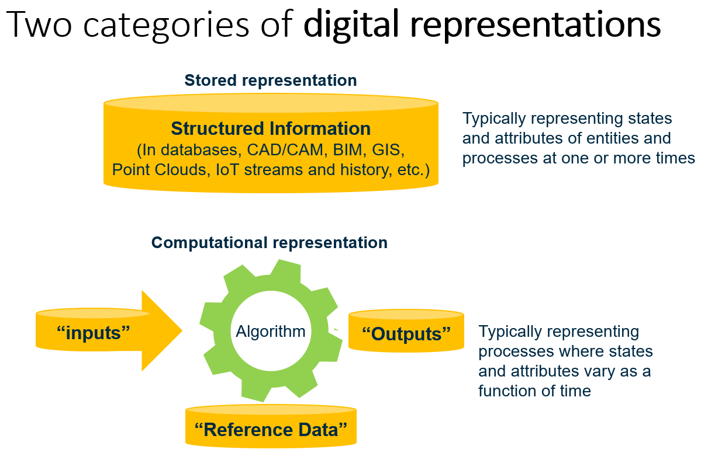
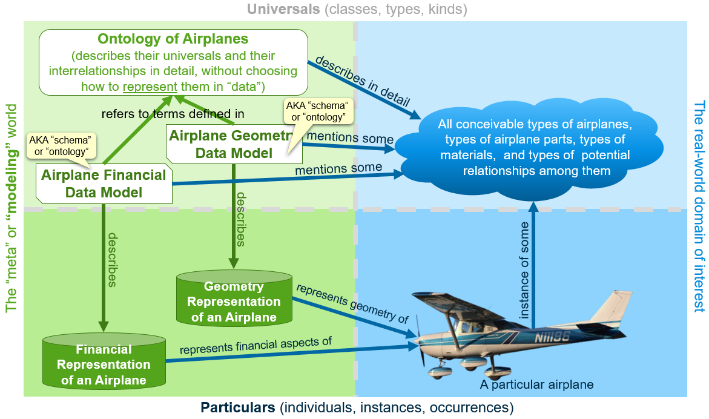
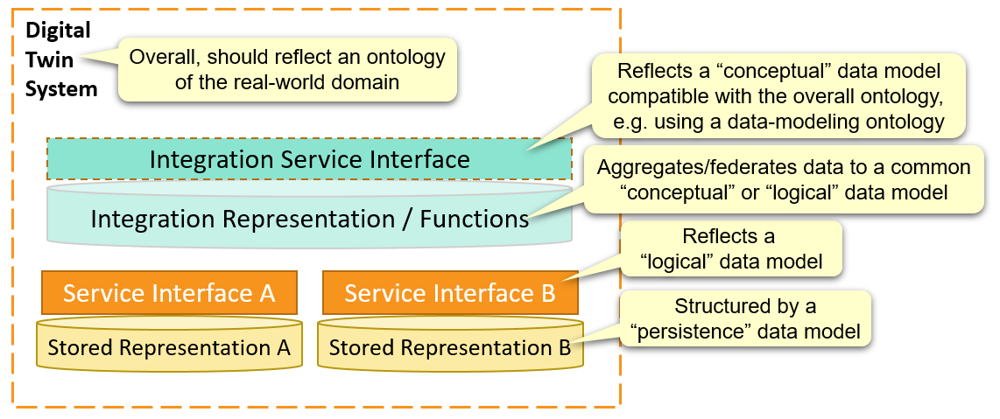

<!-- omit in TOC -->
# Glossary of Digital Twins

> A glossary of digital twins and digital twin technology from the [Digital Twin Consortium](https://www.digitaltwinconsortium.org/).

This glossary is not intended to cover industry-specific domains for which one might build a [digital twin system](#digital-twin-system).

The glossary is a Work-In-Progress draft.

We suggest starting with the term [Digital Twin](#digital-twin) and following links from there.

<!-- omit in TOC -->
## Table of Contents

- [Aggregation](#aggregation)
- [Computational Representation](#computational-representation)
- [Cyber-Physical System](#cyber-physical-system)
- [Data Interoperability](#data-interoperability)
- [Data Model](#data-model)
- [Data Modeling in Digital Twin Systems](#data-modeling-in-digital-twin-systems)
- [Data Modeling Language](#data-modeling-language)
- [Data-modeling Ontology](#data-modeling-ontology)
- [Data Modeling Paradigm](#data-modeling-paradigm)
- [Digital Representation](#digital-representation)
- [Digital System-of-Systems](#digital-system-of-systems)
- [Digital Thread](#digital-thread)
- [Digital Twin](#digital-twin)
- [Digital Twin Applications](#digital-twin-applications)
- [Digital Twin Platform](#digital-twin-platform)
- [Digital Twin Services](#digital-twin-services)
- [Digital Twin System](#digital-twin-system)
- [Digital Twin System Feature](#digital-twin-system-feature)
- [Digital Twin Use Case](#digital-twin-use-case)
- [Federation](#federation)
- [Integration Representation/Function](#integration-representationfunction)
- [Integration Service Interface](#integration-service-interface)
- [Integration Strategies](#integration-strategies)
- [Interventional Frequency](#interventional-frequency)
- [IT/OT Platform](#itot-platform)
- [Management and Automation](#management-and-automation)
- [Model](#model)
- [Modeling Fidelity](#modeling-fidelity)
- [Observational Frequency](#observational-frequency)
- [Ontology](#ontology)
- [Physical Twin](#physical-twin)
- [Real-to-virtual synchronization](#real-to-virtual-synchronization)
- [Real-World](#real-world)
- [Security, Trust, and Governance](#security-trust-and-governance)
- [Service Interface](#service-interface)
- [Simulation Modeling Language](#simulation-modeling-language)
- [Subsystems of a Digital Twin System](#subsystems-of-a-digital-twin-system)
- [Stored Representation](#stored-representation)
- [Synchronization](#synchronization)
- [Synchronization Fidelity](#synchronization-fidelity)
- [Synchronization Frequency](#synchronization-frequency)
- [Synchronization Mechanism](#synchronization-mechanism)
- [Use Case](#use-case)
- [Virtual](#virtual)
- [Virtual Representation](#virtual-representation)
- [Virtual-to-real synchronization](#virtual-to-real-synchronization)
- [Virtual Twin](#virtual-twin)

---

## Aggregation

> Aggregation is an [integration strategy](#integration-strategies) that involves copying data to gather it into a centralized location.

Miriam Webster defines the verb “aggregate” as “to collect or gather into a mass or whole”. In software architecture, aggregation implies gathering, copying, and possibly transforming information from multiple systems into a single centralized system.

*Back to [Table of Contents](#table-of-contents).*

---

## Computational Representation

> A computational representation is an *executable* [digital representation](#digital-representation) consisting of computational algorithms and supporting data representing some subject matter from a dynamic perspective.

Examples include simulations and predictive analytics.

The subject matter of computational representation is typically a process or a set of entities with properties that are a function of time over the time-frame of interest.

When executed (aka “run”), computational representations often take [stored representations](#stored-representation) as input and their computational algorithms produce [stored representations](#stored-representation) as output.

Computational representations may also use reference data, which is really just another example of a [stored representation](#stored-representation).

Examples of computational representations include Finite Element Analysis (FEA) models, Machine Learning models, and various other kinds of simulations based on mathematical equations, including those describing laws of physics and engineering.

***Related terms***

[Computational representations](#computational-representation) are distinguished from [stored representations](#stored-representation), that do not contain algorithms.

*Back to [Table of Contents](#table-of-contents).*

---

## Cyber-Physical System

> A system consisting of physical and digital systems integrated via networking.

A [digital twin](#digital-twin) considered together with its [physical twin](#physical-twin) is an example of a cyber-physical system.

A physical device with a closely integrated digital control system is another example of a cyber-physical system. Such a cyber-physical system may be considered a [real-world entity](#real-world) represented by a [digital twin](#digital-twin).

See [Wikipedia's definition of cyber-physical system](https://en.wikipedia.org/wiki/Cyber-physical_system).

*Back to [Table of Contents](#table-of-contents).*

---

## Data Interoperability

> Data Interoperability is a functional [digital twin subsystem](#subsystems-of-a-digital-twin-system) that supports its [integration representation/function](#integration-representationfunction) by [aggregating](#aggregation) or [federating](#federation) data from digital systems that may be considered "inside" or "external to" the [digital twin system](#digital-twin-system).

*Back to [Table of Contents](#table-of-contents).*

---

## Data Model

> A data model is a [model](#model) of data that describes its structure, datatypes, and meaning.

A data model will use some __data modeling paradigm__ that defines its approach to __structuring data__. Some examples include:

- The relational paradigm structures data into tables with columns and foreign-keys
- The entity-relationship paradigm structures data into classes with properties and supports relationship classes to express relations.
- The triple-graph paradigm structures data as a series of subject-predicate-object "triples"
- The property-graph paradigm structures data as nodes in a graph with nodes defined by classes with properties and edges defined by separate classes.

The __datatypes__ associated with columns/properties/attributes may be "text" or "date" or "number" or more specialized datatypes such as "integer number" or "floating-point number". The specific datatypes available will vary per data-modeling language.

The __meaning__ of particular data structured according to the data model may be encoded by naming data modeling elements (tables/columns/classes/properties) using the names of real-world concepts. For example, particular data that lies in the part of the structure named "equipment.weight" with datatype "number" can be understood to represent the weight of a piece of physical equipment, expressed numerically. Those names may be cross-referenced with natural-language documentation providing a more-detailed description of the meaning of the modeled data. Some data-modeling languages allow additional metadata to be associated to elements, e.g. the units-of-measure for "equipment.weight".

A given data model may lie somewhere along an __implementation spectrum__. It may be an implementation-neutral "logical" or "conceptual" data model or a persistence-specific data model like a SQL database schema. Often, a high-level conceptual data model is exposed through an API, but is mapped to a low-level implementation-specific data model by the software that implements the API.

The __subject matter__ of a data model may be the data of a [stored representation](#stored-representation). Conversely, many [stored representations](#stored-representation) have a __data model__ that describes their structure and meaning.

The __medium__ of a "data model" is a [data modeling language](#data-modeling-language).

The __modeling perspective__ of a "data model" encompasses its data-modeling paradigm, where it sits on the "implementation perspective", as well as the choices it makes to simplify the real-world subject matter into named/structured data that describes aspects of that subject matter.

The following figure shows how a [Data Model](#data-model) relates to a [Stored Representation](#stored-representation) and how both relate to the physical world.

Sometimes people use the unqualified term "model" to mean "data model", especially when they do "data modeling" as part of their job. They may use a term like "building model" to refer to a __data model__ for creating stored representations of buildings (rather than a specific digital representation of a particular building). For this reason, it may be helpful to use a synonym like "schema", since "building schema" will be more-reliably interpreted as a "data model for structuring data that represents buildings" and never as a stored representation (aka "model") of a particular building.

As an example, a stored representation of a particular real-world building will consist of data that represents relevant aspects of that building for the desired use cases. The stored representation will have a "buildings data model" that defines the concepts of real-world buildings that can be expressed in the data of the stored representation, and how they are named, structured, and represented in the stored representation's data.

See [data modeling in digital twin systems](#data-modeling-in-digital-twin-systems).

***Alternate terms***

- "Ontology" is sometimes used as a synonym for "data model", particularly for [data-modeling ontologies](#data-modeling-ontology)
- "Schema" is sometimes used as a synonym for "data model". DDL defines database schemas. [OData](https://en.wikipedia.org/wiki/Open_Data_Protocol) uses CSDL (Common Schema Definition Language). [RDFS](https://en.wikipedia.org/wiki/RDF_Schema) (Resource Description Framework Schema) is sometimes used in conjunction with [OWL](https://en.wikipedia.org/wiki/Web_Ontology_Language) to define data models using a [triple-graph](#data-modeling-paradigm) approach.
- "Information Model" is sometimes used as a synonym for "data model", though some parties make subtle distinctions between "information model" and "data model", such as taking it to imply a data model that lies on the "conceptual" end of the implementation spectrum.

The various synonyms of "data model" and the fact that some ontologies can be used as data models can be a significant source of confusion in the design and development of [stored representations](#stored-representation) for [digital twin systems](#digital-twin-system).

*Back to [Table of Contents](#table-of-contents).*

---

## Data Modeling in Digital Twin Systems

[Data models](#data-model) and [ontologies](#ontology) play various functional roles in [digital twin systems](#digital-twin-systems).

A __persistence__ [data model](#data-model) uses a [data modeling language](#data-modeling-language) to describe data structures and types in a way that is compatible with the persistence technology. If the persistence technology is a relational database, this will be a SQL DDL "schema". Other persistence technologies will use different [data modeling paradigms](#data-modeling-paradigm) and [data modeling languages](#data-modeling-language).

[Service interfaces](#service-interface) embody a __logical__ [data model](#data-model) that describes the data structures and types used by an API or protocol. This data model may differ from the lower-level persistence data model, with the API implementation handling the mapping between the two. Examples include OData's CSDL (for entity-relationship style REST APIs) and GraphQL Schema (for property-graph style APIs). Other common ways of defining the "logical" data model of an API or protocol include JSON Schema and XML schema. Non-web-based APIs model data in programming-language-specific ways.

__Conceptual__ [data models](#data-model) are intended to be relatively free of the implementation-specific functional, performance, and scalability concerns of [service interfaces](#service-interface) and [stored representations](#stored-representation) so that they can focus on describing the real-world concepts in the domain of the [digital twin](#digital-twin). These data models may or may not be machine-readable, as they may only be used to guide the development of the GUI and lower-level data models.

Conceptual data models may be used in a [digital twin system](#digital-twin-system) that is integrating information from multiple [stored representations](#stored-representation), each with its own persistence and logical data models. The digital twin system may have an [integration representation/function](#integration-representationfunction) that provides access to data using a conceptual data model that is compatible with the overall [ontology](#ontology) of the digital twin system. . A variety of data modeling languages can be used for this function, including those for [data-modeling ontologies](#data-modeling-ontology).

Because the [integration representation/function](#integration-representationfunction) may employ both [aggregation](#aggregation) and [federation](#federation) [integration strategies](#integration-strategy), data modeling languages compatible with integration-friendly service interfaces like [OData](https://en.wikipedia.org/wiki/Open_Data_Protocol), [SPARQL](https://www.w3.org/TR/rdf-sparql-query/), and [GraphQL](https://graphql.org/) may be useful. These support both access to aggregated [integration representations](#integration-representationfunction) and mapping to physically-separate federated [stored representations](#stored-representation).

Most [data modeling languages](#data-modeling-language) can be used in many of these functional roles, and roles can be combined. A single data model could be used at the conceptual, service interface, and persistence levels if system requirements can be met. The [data-modeling ontology](#data-modeling-ontology) of the [integration service interface](#integration-service-interface) may be used as the overall [ontology](#ontology) of the digital twin system and the data model of the [integration representation/function](#integration-representationfunction).

*Back to [Table of Contents](#table-of-contents).*

---

## Data Modeling Language

> A data modeling language is a lexical or graphical language used define the data structures and data types of a [data model](#data-model).

Examples of graphical data modeling languages include:

- UML (Unified Modeling Language): a general modeling language that can be used for data modeling.
- ERD (Entity Relationship Diagrams): a data modeling language well-suited for relational databases.

Lexical data modeling languages include:

- SQL Data Definition Language (DDL): The standard language for [relational](#data-modeling-paradigm) database schemas.
- Digital Twin Definition Language [(DTDL)](https://github.com/Azure/opendigitaltwins-dtdl/blob/master/DTDL/v2/dtdlv2.md#digital-twins-definition-language): A [property-graph](#data-modeling-paradigm)  data-modeling language with support for integration with IoT via "telemetry" properties. DTDL was created by Microsoft and open-sourced.
- [GraphQL Schema](https://graphql.org/learn/schema/): A [property-graph](#data-modeling-paradigm) data-modeling language used with [GraphQL](https://graphql.org/) to support federation of data from multiple sources and purpose-specific views of data. GraphQL was created by Facebook and open-sourced.
- Web Ontology Language [(OWL)](https://en.wikipedia.org/wiki/Web_Ontology_Language): A [triple-graph](#data-modeling-paradigm) data-modeling language that is part of the [Semantic Web Stack](https://en.wikipedia.org/wiki/Semantic_Web_Stack).
- [EXPRESS](https://en.wikipedia.org/wiki/EXPRESS_(data_modeling_language)): A [entity-relationship](#data-modeling-paradigm) data-modeling language used by [STEP](http://deslab.mit.edu/DesignLab/dicpm/step.html) for modeling geometry and [IFC](https://www.buildingsmart.org/standards/bsi-standards/industry-foundation-classes/#:~:text=IFC%20is%20a%20standardized%2C%20digital,for%20many%20different%20use%20cases.) for modeling built assets.
- Many more examples can be found [here](#data-modeling-language).

See [data modeling in digital twin systems](#data-modeling-in-digital-twin-systems).

*Back to [Table of Contents](#table-of-contents).*

---

## Data-modeling Ontology

> A data-modeling ontology is an [ontology](#ontology) that is also a conceptual [data model](#data-model).

Data-modeling ontologies describe real-world [universals](https://en.wikipedia.org/wiki/Universal_(metaphysics)) using data structures and datatypes in a particular [data-modeling paradigm](#data-modeling-paradigm). Ideally, they also include precise human-readable definitions of the universals that they are describing.

An incomplete list of examples of data-modeling ontologies relevant to digital twins includes:

- [DTDL](https://github.com/Azure/opendigitaltwins-dtdl/blob/master/DTDL/v2/dtdlv2.md#digital-twins-definition-language)
- [OWL](https://en.wikipedia.org/wiki/Web_Ontology_Language)

Though data-modeling ontologies define data structures and datatypes that *can* be used to represent instances of the ontologically-defined entities, those data structures and types don't have to be used to store or transmit the data. Data stored in different data structures can refer to the terms defined by the ontology to clarify the semantics of the data. Data-modeling ontologies may prioritize unambiguous description of universals over optimization of data persistence.

*Back to [Table of Contents](#table-of-contents).*

---

## Data Modeling Paradigm

> A data modeling paradigm is an approach to data modeling embodied in a set of fundamental constructs that govern how data is structured and typed.

Some common examples include:

- The __relational paradigm__ structures data into tables with columns and foreign-keys
- The __entity-relationship paradigm__ structures data into classes with properties and supports relationship classes to express relations.
- The __triple-graph paradigm__ structures data as a series of subject-predicate-object "triples"
- The __property-graph paradigm__ structures data as nodes in a graph with nodes defined by classes with properties and edges defined by separate classes.
- JSON uses an __object-oriented__ data-modeling paradigm defined by [ECMA-404](#https://www.ecma-international.org/publications-and-standards/standards/ecma-404/).
- XML uses a __hierarchical__ data-modeling paradigm defined by the [W3C XML Information Set](https://www.w3.org/TR/xml-infoset/).

Specialized [stored representations](#stored-representation) may use idiosyncratic data modeling paradigms.

See [data modeling in digital twin systems](#data-modeling-in-digital-twin-systems).

*Back to [Table of Contents](#table-of-contents).*

---

## Digital Representation

> A digital representation is a representation (aka "[model](#model)") of some subject matter consisting of structured digital information and/or computational algorithms.

Before computers, we represented/modeled physical things using clay, wood, or plastic models or drawings on paper. Nowadays, we use digital representations, which may include 3D models, drawings, or lexical databases of various sorts.

***Alternate terms***
"Digital model" can be used as a synonym for "digital representation."

***Narrower terms***

- We can generally divide digital representations into two broad categories: [stored representations](#stored-representation) and [computational representations](#computational-representation), though there can be some overlap between those categories.

***Related terms***

- In the context of our definition of [digital twin](#digital-twin), a digital representation's subject matter may include many entities and processes.
  
*Back to [Table of Contents](#table-of-contents).*

---

## Digital System-of-Systems

> A digital system-of-systems is a digital system comprised of one or more other digital systems

*Back to [Table of Contents](#table-of-contents).*

---

## Digital Thread

> Digital thread is a mechanism for correlating information across multiple dimensions of the virtual representation, where the dimensions include (but are not limited to) time or lifecycle stage (including design intent), kind-of-model, and configuration history.

Digital thread generally relies on stable, consistent real-world identifiers to "join" across different repositories of information.

*Back to [Table of Contents](#table-of-contents).*

---

## Digital Twin

> A digital twin is a [virtual representation](#virtual-representation) of [real-world entities and processes](#real-world), [synchronized](#synchronization) at a specified [frequency](#synchronization-frequency) and [fidelity](#synchronization-fidelity).

[Digital Twin Systems](#digital-twin-system) transform business by accelerating holistic understanding, optimal decision-making, and effective action.

Digital Twins use real-time and historical data to represent the past and present and simulate predicted futures.

Digital Twins are motivated by outcomes, tailored to use cases, powered by integration, built on data, guided by domain knowledge, and implemented in IT/OT systems.

***Alternate, non-preferred terms***

- [Virtual Twin](#virtual-twin)

***Related terms***

- A digital twin is implemented in a [digital twin system](#digital-twin-system).
- The [stored representations](#stored-representation) that constitute a digital twin are synchronized at a specified [frequency](#synchronization-frequency).
- The [stored representations](#stored-representation) that constitute a digital twin are synchronized at a specified [fidelity](#synchronization-fidelity).
- A digital twin has a corresponding [physical twin](#physical-twin).
- A digital twin is part of a [cyber-physical system](#cyber-physical-system).

[//]: # (This entry was written by DTC 3T Committee)
[//]: # (Some other example comment or metadata)

*Back to [Table of Contents](#table-of-contents).*

---

## Digital Twin Applications

> Digital twin applications are software applications that leverage [digital twin services](#digital-twin-services) and/or [service interfaces](#service-interfaces).

Digital twin applications may be considered to be "using" a [digital twin system](#digital-twin-system) or to be "part of" such a system.

Digital twin applications are driven by use-cases.

*Back to [Table of Contents](#table-of-contents).*

---

## Digital Twin Platform

> A digital twin platform is a set of integrated [services](#digital-twin-services), [applications](#digital-twin-applications), and other [digital twin subsystems](#subsystems-of-a-digital-twin-system) that are designed to be used to implement [digital twin systems].

*Back to [Table of Contents](#table-of-contents).*

---

## Digital Twin Services

> Digital twin services are [functional subsystems](#subsystems-of-a-digital-twin-system) of a [digital twin system](#digital-twin-system) that provide value by leveraging the [digital twin](#digital-twin).

Examples of digital twin services include:

- Visualization services for web, mobile, desktop, Virtual Reality (VR), and Augmented Reality (AR) devices.
- Analysis services of various kinds.
- Many other kinds of services that will be enumerated at a later date.

Most digital twin services provide a [service interface](#service-interface) for use by other services and [digital twin applications](#digital-twin-applications).

*Back to [Table of Contents](#table-of-contents).*

---

## Digital Twin System

> A digital twin system is a [system-of-systems](#digital-system-of-systems) that implements a [digital twin](#digital-twin).

***Related terms***

- A digital twin system implements a [digital twin](#digital-twin).
- A digital twin system comprises [functional subsystems](#subsystems-of-a-digital-twin-system) that implement [digital twin system features](#digital-twin-system-feature).
- [Digital twin platforms](#digital-twin-platform) provide a purpose-specific foundation for a digital twin system.
- [Digital twin applications](#digital-twin-applications).
- [Digital twin services](#digital-twin-services).
- [Integration service interface](#integration-service-interface).
- [Virtual representation](#virtual-representation).
- [Integration representation/function](#integration-representationfunction).
- [Service interface](#service-interface).
- [Computational representation](#computational-representation).
- [Stored representation](#stored-representation).
- [Synchronization mechanisms](#synchronization-mechanism).
- [Data Interoperability](#data-interoperability).
- [Management & Automation](#management-and-automation).
- [IT/OT Platform](#itot-platform).
- [Security, Trust, and Governance](#security-trust-and-governance).
- [Real-World](#real-world).

*Back to [Table of Contents](#table-of-contents).*

---

## Digital Twin System Feature

> A digital twin system feature is a functionality of a [digital twin system](#digital-twin-system).

Digital twin system features are generally implemented by [subsystems of the digital twin system](#subsystems-of-a-digital-twin-system)

*Back to [Table of Contents](#table-of-contents).*

---

## Digital Twin Use Case

> A digital twin use case is a [use case](#use-case) in which digital twins may be used to accomplish desired outcomes.

Digital Twin use cases are designed to improve outcomes, provide requirements for digital twin systems.

A digital twin use case typically defines requirements for [synchronization](#synchronization) including [synchronization frequency](#synchronization-frequency), etc.

*Back to [Table of Contents](#table-of-contents).*

---

## Federation

> Federation is an [integration strategy](#integration-strategies) that involves coordinated access to data repositories without making centralized copies of them.

Federation only implies gathering enough centralized "index" information to use the federated systems in a coordinated manner, without copying the bulk of their data. If transformation of data is required, it is performed on-the-fly.

*Back to [Table of Contents](#table-of-contents).*

---

## Integration Representation/Function

> The integration representation/function is a subsystem of a [digital twin system](#digital-twin-system) that provides integrated and semantically-aligned access to the [stored representations](#stored-representation) of the digital twin system.

The integration representation/function may comprise a [stored representation](#stored-representation) for data [aggregation](#aggregation) and functions for data [federation](#federation).

The integration representation/function is closely associated with [digital thread](#digital-thread).

See [data modeling in digital twin systems](#data-modeling-in-digital-twin-systems).

*Back to [Table of Contents](#table-of-contents).*

---

## Integration Service Interface

> A integration service interface is a [service interface](#service-interface) for the [integration representation/function](#integration-representationfunction) of a [digital twin system](#digital-twin-system).

*Back to [Table of Contents](#table-of-contents).*

---

## Integration Strategies

> Integration Strategies (in digital twin systems) are strategies for integrating data/information to achieve a cohesive [virtual representation](#virtual-representation).

In software architecture, there are two main patterns for data integration: [aggregation](#aggregation) and [federation](#federation).

Individual [stored representations](#stored-representation) (including the inputs and outputs of [computational representations](#computational-representation)) can be integrated by the [integration representation/function](#integration-representationfunction) of a [digital twin system](#digital-twin-system).

The [integration service interface](#integration-service-interface) of a [digital twin system](#digital-twin-system) can function as the [service interface](#service-interface) that exposes the overall digital twin system as a [stored representation](#stored-representation) which can in turn be aggregated by a "larger" digital twin system--a federation of digital twin systems.

*Back to [Table of Contents](#table-of-contents).*

---

## Interventional Frequency

> An interventional frequency is a [synchronization frequency](#synchronization-frequency) characterizing how often interventions in reality occur in order to synchronize reality with the state of a [stored representation](#stored-representation).

*Back to [Table of Contents](#table-of-contents).*

---

## IT/OT Platform

> The IT/OT Platform of a [digital twin system](#digital-twin-system) is the set of Information Technology and Operational Technology infrastructure and services on which the [subsystems of a digital twin system](#subsystems-of-a-digital-twin-system) are implemented.

Subsystems of the IT/OT Platform include:

- A software platform and tooling stack.
- Platform APIs
- Orchestration of low-level infrastructure
- Compute, storage, and networking infrastructure

These systems could be cloud-based, on premises, embedded, mobile, distributed, etc.

*Back to [Table of Contents](#table-of-contents).*

---

## Management and Automation

> Management and Automation is a functional [digital twin subsystem](#subsystems-of-a-digital-twin-system) that supports general management and operation of the [digital twin system](#digital-twin-system).

*Back to [Table of Contents](#table-of-contents).*

---

## Model

> A representation __of__ some subject matter modeled __in__ some medium __from__ some modeling perspective.

The __subject matter__ could be a car, a city, a supply chain, or a factory and its surroundings.

The __modeling medium__ could be clay, wood, plastic, mathematical equations in a spreadsheet, or ink-on-paper. [Digital twins](#digital-twin) are mostly concerned with the "digital" medium--information stored as bits and bytes that can be loaded into a computer's working memory.

The __modeling perspective__ is the set simplifications made by the modeler. Every model simplifies its subject matter in some way, otherwise it would be an actual replica of the subject matter. It may be smaller in scale or lower in fidelity. It may only represent geometric aspects or also represent material composition. It may only represent functional or financial or legal aspects. It may represent a complex 3D form as a simple curve in space or as a set of triangles. It is common for representational models to represent "any and all aspects of the subject matter that are relevant to the use cases for the model" without explicitly stating their modeling perspective.

When you see "____ model" sometimes the blank is filled with the subject matter (e.g. a "building model") and sometimes with a modeling media (e.g. a "clay model" or "digital model") and occasionally even with a modeling perspective (e.g. a "functional model", "physical model", or "financial model").

Whether a digital model is a [stored representation](#stored-representation) or [computational representation](#computational-representation) can also be considered part of its modeling perspective.

*Back to [Table of Contents](#table-of-contents).*

---

## Modeling Fidelity

*Back to [Table of Contents](#table-of-contents).*

---

## Observational Frequency

> An observational frequency is a [synchronization frequency](#synchronization-frequency) characterizing how often observations of reality are made and reflected in a [stored representation](#stored-representation).

*Back to [Table of Contents](#table-of-contents).*

---

## Ontology

> An ontology is a representational artefact that describes universals and certain relations among them in a domain of interest.

"Universals" are types or classes of entities, in contrast to "particulars" which are instances of entities.

An ontology can be written in any number of natural or formal languages and a given ontological understanding can be represented in more than one language.

A human-readable ontology is used to assist peoples understanding of and communication regarding the ontology's domain.

A machine-readable ontology can be read by software to associate the semantics defined in the ontology with data. This may make the data more meaningful to humans. It may also facilitate data interoperability if data structures from different systems are mapped to terms from a common ontology.

Machine-readable ontologies should also include detailed human-readable definitions of their terms in order to be used effectively for meaningful semantic mapping.

Ontologies generally do not specify data structures or data types used to represent particular entities, but [data-modeling ontologies](#data-modeling-ontology) do.

An ontology can be used in a [digital twin system](#digital-twin-system) to provide consistent semantics and support data integration among different [stored representations].

Also see wikipedia's entry for [ontology (information science)](https://en.wikipedia.org/wiki/Ontology_(information_science)) and [ontology (philosophical)](https://en.wikipedia.org/wiki/Ontology).

*The given definition is a simplified version of the definition from "Building Ontologies with Basic Formal Ontology" by Barry Smith.*

*Back to [Table of Contents](#table-of-contents).*

---

## Physical Twin

> A physical twin is a set of real-world entities and processes that corresponds to a [digital twin](#digital-twin)

The physical twin is the subject matter [modeled](#model) by a digital twin.

The physical twin may constitute physical systems of interest and their environment, interactions, and processes.

***Alternate, non-preferred terms***

- Physical asset - May be used in specific domains (such as infrastructure), but is not broad enough for general purposes.

*Back to [Table of Contents](#table-of-contents).*

---

## Real-to-virtual synchronization

> Real-to-virtual synchronization (aka observational synchronization) is [synchronization](#synchronization) that causes a [stored representation](#stored-representation) to reflect new observations of the real world.

In other words, it is the process of mirroring the real world in the virtual representation, based on observation of the real-world.

*Back to [Table of Contents](#table-of-contents).*

---

## Real-World

> In the context of [digital twins](#digital-twin), "real-world" refers to the subject matter of a [stored representation](#stored-representation) or [digital twin](#digital-twin) (which can be considered as a kind of stored representation).

The DTC definition of digital twin refers to "real-world entities and processes," where:

- "Entities" refers to things that __exist__ over a significant time-span. These are typically physical objects and systems but also include immaterial things like organizations, supply-chains, work-orders, etc.
- "Processes" refers to events or activities that __occur__ in time. These might be transportation journeys or accidents, power outages, pharmaceutical production processes, weather events, heart attacks, or destructive processes such as corrosion or earthquakes.

The interactions among entities and processes are also included in the "real-world" subject matter.

Because [digital twin systems](#digital-twin-system) are "real", the term "real-world" in our context refers to portion of the real-world that is __outside__ of the digital twin system and is the subject matter of its digital twin. Of course, one could implement a separate digital twin of the [IT/OT Systems](#itot-system) that implement a given digital twin system.

*Back to [Table of Contents](#table-of-contents).*

---

## Security, Trust, and Governance

> Security, Trust, and Governance are a set of foundational concerns for a the [functional subsystems](#subsystems-of-a-digital-twin-system) of a [digital twin system](#digital-twin-system).

The concerns include privacy, security, safety, resilience, and reliability.

*Back to [Table of Contents](#table-of-contents).*

---

## Service Interface

> A system’s service interface is a digitally addressable endpoint that implements a protocol through which other systems and services may interact with the system.

***Narrower terms***

- Each [subsystem](#subsystems-of-a-digital-twin-system) may have its own service interface, e.g. a virtual representation service interface, or a service interface for a particular kind of stored representation, or a visualization service interface, etc.

*Back to [Table of Contents](#table-of-contents).*

---

## Simulation Modeling Language

> A simulation modeling language is a lexical or graphic language used to define simulation models for [computational representations](#computational-representation).

Examples include [Modelica](#https://www.modelica.org/), [Simulink](https://www.mathworks.com/products/simulink.html), etc. Simulations can also be coded in programming languages such as FORTRAN, C, Lisp, etc. Not all computational representations are defined via simulation modeling languages, because simulation techniques and technologies vary widely.

See wikipedia for [simulation languages](https://en.wikipedia.org/wiki/Simulation_language) and [simulation software](https://en.wikipedia.org/wiki/List_of_computer_simulation_software).

*Back to [Table of Contents](#table-of-contents).*

---

## Subsystems of a Digital Twin System

> A subsystem of a digital twin system is a system that implements a [digital twin system feature](#digital-twin-system-feature).

Examples are listed in the entry for [digital twin system](#digital-twin-system).

Subsystems of a digital twin system may have [service interfaces](#service-interface)

*Back to [Table of Contents](#table-of-contents).*

---

## Stored Representation

> A stored representation is a [digital representation](#digital-representation) consisting of stored structured information, representing states of some subject matter.

A stored representation can be queried, in contrast to a [computational representation](#computational-representation), which must be executed to produce output.

Stored representations can take the form of databases of all kinds including relational databases, graph databases and other NoSQL databases, IoT "data historians", specialized CAD, BIM, and GIS repositories, 3D meshes derived from photogrammetry and/or point clouds, satellite or radar imagery, spreadsheets, intelligent 2D drawings and schematics, etc.

***Related terms***

- [Stored representations](#stored-representation) are distinguished from [computational representations](#computational-representation), that contain algorithms.

*Back to [Table of Contents](#table-of-contents).*

---

## Synchronization

> Synchronization is the process of causing the [virtual representation](#virtual-representation) to more-closely match the real-world or cause the real-world to more-closely match the [virtual representation](#virtual-representation) of a desired state.

Synchronization is implemented via some [synchronization mechanism](#synchronization-mechanism).

***Narrower terms***

- [Real-to-virtual synchronization](#real-to-virtual-synchronization)
- [Virtual-to-real synchronization](#virtual-to-real-synchronization)

*Back to [Table of Contents](#table-of-contents).*

---

## Synchronization Fidelity

*Back to [Table of Contents](#table-of-contents).*

---

## Synchronization Frequency

> Synchronization Frequency is a frequency characterizing how often [synchronization](#synchronization) occurs

The frequency will not be uniform for a digital twin. It may vary per [stored representation](#stored-representation) or even within the stored representation.

***Narrower terms***

- [Observational Frequency](#observational-frequency)
- [Interventional Frequency](#interventional-frequency)

*Back to [Table of Contents](#table-of-contents).*

---

## Synchronization Mechanism

> A synchronization mechanism is a mechanism through which [synchronization](#synchronization) is implemented.

*Back to [Table of Contents](#table-of-contents).*

---

## Use Case

> A use case is a set of circumstances or a scenario for the use of something.

A use case is typically associated with constraints or other requirements.

*Back to [Table of Contents](#table-of-contents).*

---

## Virtual

> Not physically existing as such but made by software to appear to do so.

We have used [google's definition of "virtual"](https://www.google.com/search?q=definition+of+virtual), because it captures the *intent* of a [digital twin](#digital-twin) to allow one to *virtually* interact with a portion of reality without *actually* directly interacting with it. Virtual observations are indirect (and may be of lower fidelity than actual in-person observations), but sensors may also provide more accurate, quantified observations that can be recorded for future reference. The digital virtual world is also more *accessible* that the real one, and it is *machine-readable*, so that computers can query it and perform analytics and simulations with it.

"Virtual" is not technically a synonym for "digital", but in the context of a [digital twin](#digital-twin) the virtual world is implemented digitally, and the terms are used somewhat interchangeably. "Virtual" conveys more of the *intent* of creating an accessible replica of the real world and "digital" conveys an important *implementation detail*.

Thus the intent of the term "[virtual representation](#virtual-representation)" was to convey a digital artefact that serves as a "virtual replica" of the real-world or a "virtual world" that mirrors the real world. The [virtual representation](#virtual-representation) consists of [stored representations](#stored-representation) with different [modeling perspectives](#model), but by "joining" them together with [digital threads](#digital-thread) we achieve a complex, multi-facetted model (aka "representation") that is greater than the sum of its parts. The [virtual representation](#virtual-representation) aspires to give the "appearance of" a reality that is richer than any individual [stored representation](#stored-representation).

*Back to [Table of Contents](#table-of-contents).*

---

## Virtual Representation

> A virtual representation is a complex, cohesive [digital representation](#digital-representation) comprised of [stored representations](#stored-representation), [computational representations](#computational-representation), unstructured data, and supporting data which collectively provide an information-rich "virtual" experience of their subject matter.

The [integration representation/function](#integration-representationfunction) of a [digital twin system](#digital-twin-system) "[virtually](#virtual)" joins information of various kinds together into the cohesive, multi-faceted, representation of reality that we call a "virtual representation".

***Alternate terms***

- Avatar
- Virtual replica

*Back to [Table of Contents](#table-of-contents).*

---

## Virtual-to-real synchronization

> Virtual-to-real synchronization (aka interventional synchronization) is [synchronization](#synchronization) that intervenes in the real world to make it more-closely match a [stored representation](#stored-representation) of a desired state.

In other words, it is the process of mirroring the virtual representation into the real world, through some intervention in the real world.

*Back to [Table of Contents](#table-of-contents).*

---

## Virtual Twin

Use [digital twin](#digital-twin) instead. See [virtual](#virtual).

*Back to [Table of Contents](#table-of-contents).*

---
